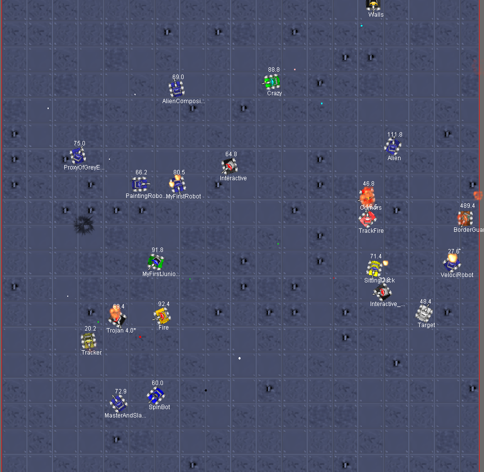
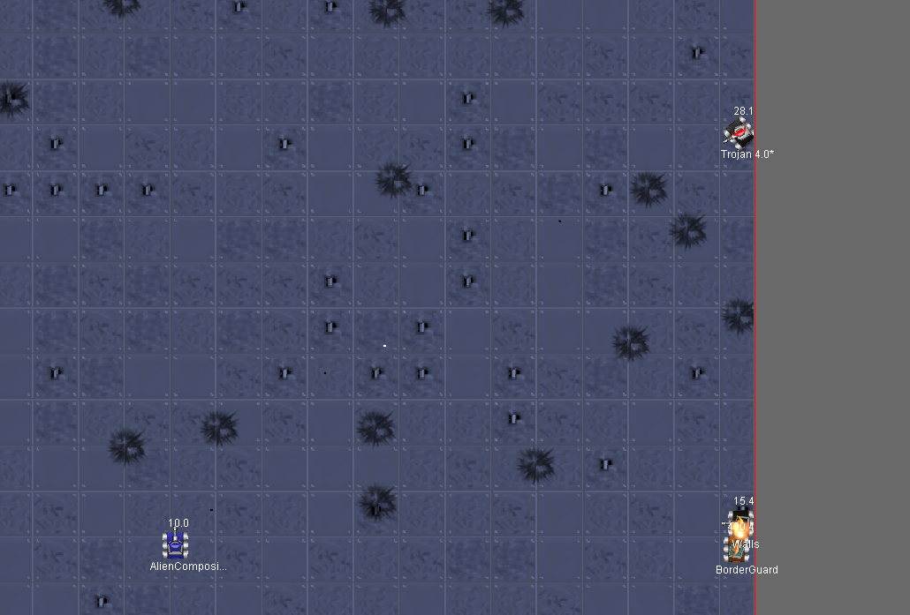
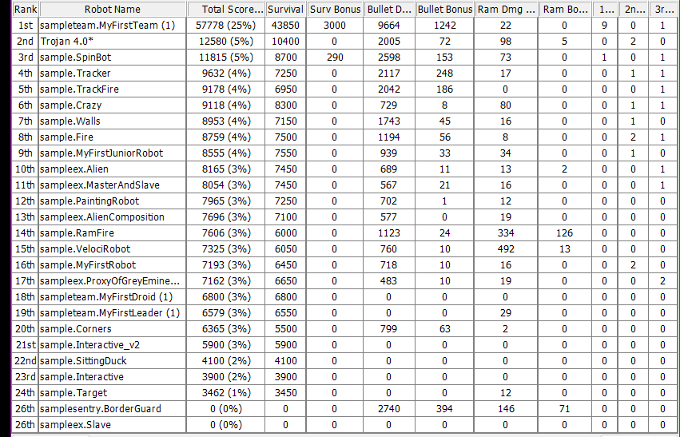

# Cavalo de Tróia da Silva - O Trojan

## 1. Introdução

Este relatório documenta a atividade prática de desenvolvimento de um robô autônomo para a plataforma **Robocode** utilizando a linguagem de programação Java. O Robocode é um jogo de código aberto baseado em simulação que visa ensinar conceitos de programação e matemática (como geometria) através de batalhas entre tanques de guerra.

Paralelamente ao desenvolvimento do software, a atividade visava a aplicação prática do controle de versão por meio do **Git** e do gerenciamento remoto no **GitHub**. O controle de versão é uma função fundamental na programação, pois permite registrar o histórico de modificações do código, reverter estados caso ocorram falhas, ramificar o desenvolvimento para testes de novas funcionalidades de forma isolada e integrar o trabalho de múltiplos programadores de maneira coordenada e segura.

## 2. Objetivos da Atividade

Os principais objetivos definidos para a realização desta atividade foram:

* **Desenvolvimento em Java:** Praticar a lógica de programação orientada a objetos a partir da API do Robocode, utilizando a classe `AdvancedRobot` para controle refinado de movimentos e ações de forma assíncrona.
* **Domínio do Git e GitHub:** Compreender o fluxo de trabalho profissional, incluindo criação de repositórios, ramificações (*branches*), commits estruturados e integração de código via *Pull Requests*.
* **Trabalho em Equipe e Colaboração:** Desenvolver *soft-skills* ligadas à comunicação e coordenação técnica, garantindo que as modificações de cada integrante fossem unificadas sem perdas de progresso ou conflitos destrutivos.
* **Construção de Lógica Competitiva:** Implementar algoritmos de mira preditiva, esquiva aleatória e gestão de energia para que o tanque fosse capaz de sobreviver em batalhas com diversos robôs.

## 3. Descrição da Atividade

### O Processo de Programação do Tanque (Trojan)

O robô desenvolvido foi nomeado de **Trojan**. Ele foi construído herdando as propriedades da classe `AdvancedRobot`, o que permite que suas partes se movam de forma independente.

A lógica interna foi estruturada da seguinte forma:

1. **Rastreamento Contínuo:** No loop principal (`run`), o radar é configurado para girar indefinidamente para a direita usando `Double.POSITIVE_INFINITY`. Isso garante a varredura constante da arena.
2. **Movimentação Antirrastreamento (Orbital):** Ao detectar um inimigo (`onScannedRobot`), o Trojan se move de forma perpendicular ao oponente (somando 90 graus ao ângulo relativo do alvo), gerando uma órbita ao redor dele. Para evitar ser um alvo previsível, o robô inverte seu sentido de direção de forma probabilística (`Math.random() > 0.99`) ou sempre que colide com paredes (`onHitWall`) ou outros robôs (`onHitRobot`).
3. **Gerenciamento de Energia e Tiros:** A potência do tiro é inversamente proporcional à distância do alvo. Para distâncias curtas (menores que 200 pixels), dispara com potência máxima (3.0). Em distâncias longas (maiores que 600 pixels), reduz para 1.0 para economizar energia. Se a vida do robô cair abaixo de 15, ele entra em modo de sobrevivência extrema, atirando com potência mínima (0.1).
4. **Mira Preditiva Avançada:** Utilizando conceitos matemáticos de velocidade relativa e ângulo de escape (`Math.asin`), o robô calcula onde o inimigo estará no futuro com base na velocidade atual dele e na velocidade da bala projetada, ajustando o canhão antes de efetuar o disparo.
5. **Priorização de Alvos:** O robô mantém o foco no mesmo inimigo até que ele seja destruído (`onRobotDeath`) ou caso um novo inimigo se aproxime perigosamente (menos de 150 pixels), trocando o alvo prioritário para autodefesa.

### Uso do Git para Controle de Versão e Colaboração

Para o desenvolvimento, foi adotada uma abordagem incremental e iterativa. Cada alteração crítica no robô foi tratada como uma tarefa distinta: os ajustes na lógica do radar, as correções no padrão de movimentação, os refinamentos na potência dos tiros e os retoques na priorização de alvos foram codificados sequencialmente.

A colaboração ocorreu dividindo o projeto em frentes de trabalho, com cada participante criando ramificações locais e subiam suas contribuições para o GitHub, onde passavam pelo sistema de Pull Request, onde o admin do repositório fazia o check-up e avaliava se passava para a `master`.

## 4. Estrutura do Git Utilizada

### Repositório

O repositório local foi inicializado no diretório do projeto e vinculado a um repositório remoto no GitHub. Ele foi organizado de forma a conter o código-fonte principal (`Trojan.java`) e a estrutura de diretórios padrão do ambiente Robocode.

### Branches (Ramificações)

Para manter a estabilidade do código, foi utilizado diversas ramificações, por meio de diferentes branches e commits, permitindo testes isolados.
Exemplos:

* `master`: O ramo principal e de produção, contendo apenas versões totalmente testadas e prontas.
* `pre-master`: Tinha a função de servir como ambiente de homologação (*staging*), onde as alterações eram unidas e validadas antes de irem em definitivo para a `master`.
* `ultimos-ajustes`: Foi criada no fim do projeto, para armazenar as últimas funções geradas, antes de passar pela `pre-master` e receber novas avaliações.
* *Branches de Funcionalidades (Features):* Ramos específicos como `movimento-do-robozao`, `edição-de-Prioridade`, `ajuste-projeto` e `uniao-de-branches` permitiram que implementações paralelas fossem testadas sem corromper o trabalho em andamento dos colegas.

### Commits

Adotamos a boa prática de commits granulares, sequenciais e com mensagens claras indicando exatamente o que foi adicionado ou corrigido. O histórico do projeto reflete essa organização através da numeração de etapas:

* `a3d2837 Package importada` (Preparação do ambiente)
* `0023e2e 1 - Ajuste no radar` (Foco inicial no escaneamento)
* `6a77484 2 - Fixa sistema de movimento por tiro` (Movimentação básica)
* `58449a2 3 - Ajusta a velocidade do robô e a potência dos tiros` (Calibragem dinâmica)
* `ee9fe08 4 - Reseta quando o robo inimigo morre e ataca o outro robo` (Lógica de múltiplos alvos)
* `5ac9cd8 5 - Melhora as funções de prioridade-alvo` (Refinamento tático)
* `a31bf7e 6 - Adiciona variável 'enemyName' na funcao 'onRobotDeath'` (Correção de bugs)
* `e28a863 7 - Melhora função de prioridade e movimentacao` (Otimização)
* `83acdea Ajustes antes do envio a master` (Preparação final)
* `48fb80b Trojan compactado` (Preparação do pacote de entrega)

### Pull Requests (PRs)

Os *Pull Requests* foram o mecanismo crucial para garantir que nenhuma alteração quebrasse a lógica existente. Através deles, o código modificado em ramos de desenvolvimento era submetido a uma requisição de mesclagem. Como observado no log, foram realizados com sucesso PRs para integrar as alterações ao ramo estável intermediário e, por fim, para a linha de produção principal:

* `Merge pull request #6 from Leo-alt-f4/pre-master`
* `Merge pull request #7 from Leo-alt-f4/pre-master` (Unificação final na `master`)

## 5. Resultados e Aprendizados

O resultado final foi altamente positivo. O robô **Trojan** demonstrou alta resiliência nas simulações, conseguindo desviar com eficácia de disparos inimigos devido à sua movimentação orbital aleatória, além de apresentar uma precisão de acerto elevada decorrente da implementação matemática da mira preditiva, o que nos levou a tratar o robô como uma espécie de 'sniper', o que inicialmente, não vinha em nossa mente.

Em termos de aprendizados técnicos, a atividade proporcionou:

* Compreensão profunda sobre tratamento de eventos em Java (`ScannedRobotEvent`, `HitWallEvent`, etc.).
* Aplicação prática de trigonometria e cálculo de vetores em programação de jogos.
* Domínio de comandos avançados do Git e resolução de fluxos complexos de ramificação.

**Desafios superados:** No início, o robô perdia o foco do alvo muito facilmente em combates com muitos tanques simultâneos. O desafio foi mitigado ao implementar regras rígidas de priorização de proximidade (commit 5 e 7), onde a introdução de uma verificação de distância limiar (150 pixels) permitiu responder a ameaças urgentes sem perder a eficiência de rastreamento de longo prazo.

## 6. Conclusão

A elaboração do robô Trojan foi uma experiência que elevou o conhecimento sobre Java e tornou o estudo divertido. O ecossistema do Robocode exigiu a aplicação de lógicas complexas e refatoração de código, enquanto as restrições e mecânicas de trabalho em equipe via Git/GitHub começaram de forma simples e com certa dificuldade para compreender o site (GitHub), mas conforme era feito mais funções e gerações de branches, mais começamos a entender o seu funcionamento e se tornou mais fácil o uso do mesmo.

A experiência consolida a importância de se escrever códigos limpos e bem documentados por meio de mensagens de commit semânticas, permitindo o crescimento escalável de projetos tecnológicos e ajudando em possíveis ajustes futuros dentro do próprio sistema.

---

## 7. Anexos

### A. Código-Fonte Completo (`Trojan.java`)

```java
import robocode.*;
import java.awt.Color;

public class Trojan extends AdvancedRobot {
    int moveDirection = 1;
    String trackName = null;

    public void run() {
        setBodyColor(Color.black);
        setGunColor(Color.white);
        setRadarColor(Color.red);
        setBulletColor(Color.black);
 
        setAdjustRadarForRobotTurn(true);
        setAdjustGunForRobotTurn(true);

        // sempre que ele nao ver um robo, ele vai ficar rodando ate achar (gira infinito para batalhas melee)
        setTurnRadarRightRadians(Double.POSITIVE_INFINITY);

        while(true) {
            // inverte a direcao aleatoriamente para que o movimento nao seja muito previsivel
            if (Math.random() > 0.99) {
                reverseDirection();
            }
            
            // garante que o radar nunca pare de rodar procurando inimigos
            if (getRadarTurnRemaining() == 0.0) {
                setTurnRadarRightRadians(Double.POSITIVE_INFINITY);
            }
            
            execute();
        }
    }

    public void onScannedRobot(ScannedRobotEvent e) {
        // funcao de prioridade: foca sempre no mesmo robo, mas muda se alguem chegar muito perto
        if (trackName == null || e.getName().equals(trackName) || e.getDistance() < 150) {
            trackName = e.getName();

            double distance = e.getDistance();
            double absoluteBearing = getHeadingRadians() + e.getBearingRadians();

            // com o robo na area do scanner, ele vai ficar rondando ao redor do robo fazendo movimento giratorio
            setTurnRight(e.getBearing() + 90 - (10 * moveDirection));
            setAhead(1000 * moveDirection);

            // sistema de tiro melhorado com condicionais
            double firePower;
            if (distance > 600) {
                firePower = 1.0;
            } else if (distance > 400) {
                firePower = 2.0;
            } else if (distance > 200) {
                firePower = 2.5;
            } else {
                firePower = 3.0;
            }

            // condicao de sobrevivencia para poupar energia
            if (getEnergy() < 15) {
                firePower = 0.1;
            }

            // calcula o movimento do inimigo para atirar onde ele vai estar (mira preditiva)
            double bulletSpeed = 20 - (3 * firePower);
            double lateralVelocity = e.getVelocity() * Math.sin(e.getHeadingRadians() - absoluteBearing);
            double escapeAngle = Math.asin(lateralVelocity / bulletSpeed);

            double gunTurn = absoluteBearing + escapeAngle - getGunHeadingRadians();
            setTurnGunRightRadians(robocode.util.Utils.normalRelativeAngle(gunTurn));

            // verifica se ta com um angulo bom para acertar o inimigo antes de atirar
            if (getGunHeat() == 0 && Math.abs(getGunTurnRemaining()) < 10) {
                setFire(firePower);
            }
        }
    }

    // reseta o rastreamento para o proximo ciclo caso o inimigo focado morra
    public void onRobotDeath(RobotDeathEvent e) {
        if (e.getName().equals(trackName)) {
            trackName = null;
        }
    }

    // se bater na parede, vira para o outro lado e se afasta
    public void onHitWall(HitWallEvent e) {
        reverseDirection();
    }

    // se bater em outro robo tenta girar para o lado oposto ao dele
    public void onHitRobot(HitRobotEvent e) {
        reverseDirection();
        if (e.getBearing() > -90 && e.getBearing() <= 90) {
            setFire(3.0);
        }
    }

    public void reverseDirection() {
        moveDirection *= -1;
    }
}

```

### B. Extrato de Logs do Git (`git log --oneline`)

```text
30c0525 (HEAD -> master, origin/master, origin/HEAD) Merge pull request #7 from Leo-alt-f4/pre-master
48fb80b (origin/pre-master, pre-master) Trojan compactado
5303f9a Merge pull request #6 from Leo-alt-f4/pre-master
83acdea Ajustes antes do envio a master
e28a863 (origin/ultimos-ajustes, ultimos-ajustes) 7 - Melhora função de prioridade e movimentacao
a31bf7e 6 - Adiciona variável 'enemyName' na funcao 'onRobotDeath'
5ac9cd8 5 - Melhora as funções de prioridade-alvo
ee9fe08 4 - Reseta quando o robo inimigo morre e ataca o outro robo
58449a2 3 - Ajusta a velocidade do robô e a potência dos tiros
6a77484 2 - Fixa sistema de movimento por tiro
0023e2e 1 - Ajuste no radar
a3d2837 Package importada

```
### C. Imagens do Robô em Combate e seu Resultado


